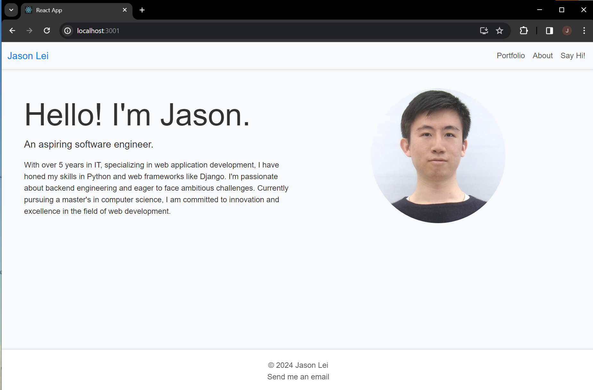
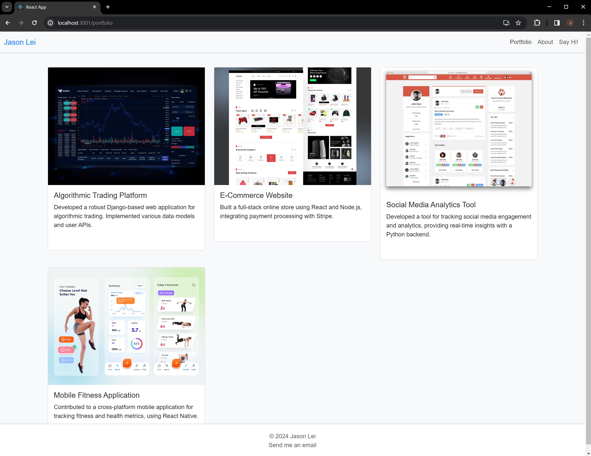
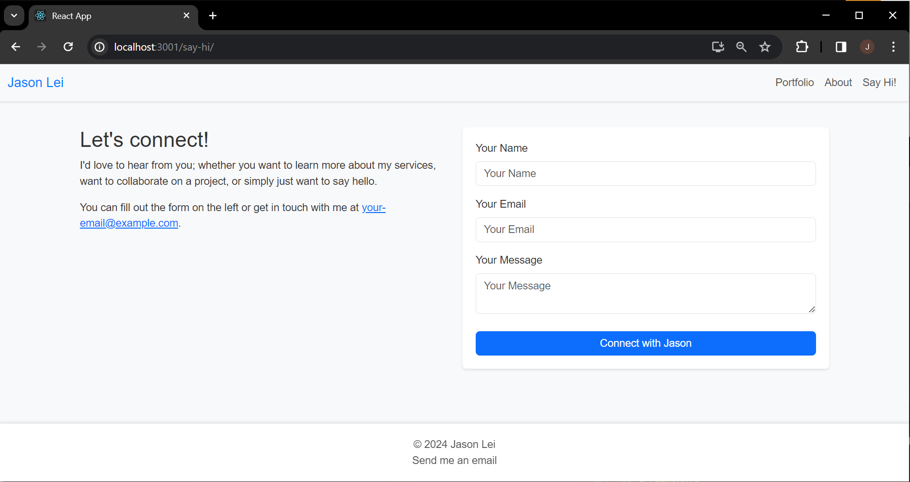
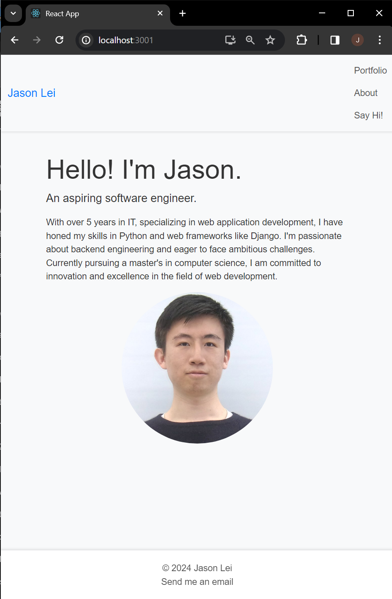
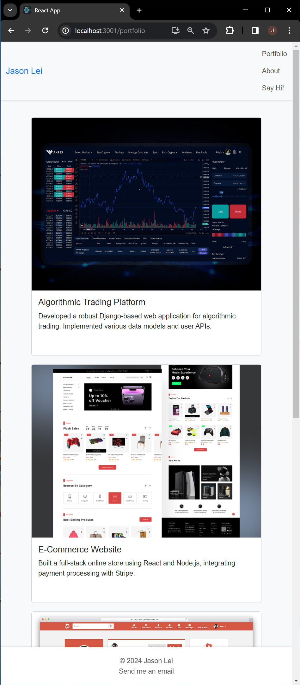
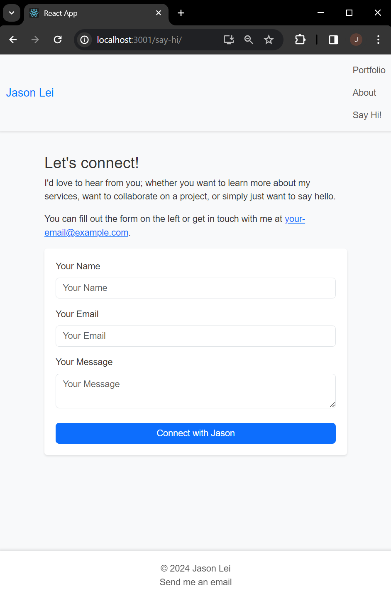

# web603-personal-portfolio

## Description
This React-based personal portfolio app presents a professional online presence for me. It highlights projects, skills, and academic pursuits in computer science with a focus on web development.

It's built using React, featuring a modern design with Bootstrap for styling.

## Simple Walkthrough

Create the app "portfolio-app" by 
```bash
$ npx create-react-app portfolio-app
```

Then with `portfolio-app/` being the current directory, install dependencies
```bash
$ npm install bootstrap reactstrap @fortawesome/fontawesome-svg-core @fortawesome/free-solid-svg-icons @fortawesome/react-fontawesome react-router-dom
```

The application is structured into React components, each representing a different section of the portfolio: About, Portfolio, and Contact.

- The About page summarizes my professional background.
- The Portfolio page displays my projects.
- The Say-Hi page is a contact form allows visitors to send messages.

All pages have a common Navigation bar at the top and a footer at the bottom.

Each component is styled using a clean and responsive design, ensuring the portfolio is accessible on any device.

At last, with `portfolio-app/` being the current directory, run the app by
```bash
$ npm start
```

Feel free to check out the endpoints available on the page.

## Screenshots
### Laptop Viewport
#### Home / About


### Portfolio


#### Say-Hi


---
### Mobile Viewport

#### Home / About


#### Portfolio


#### Say-Hi

